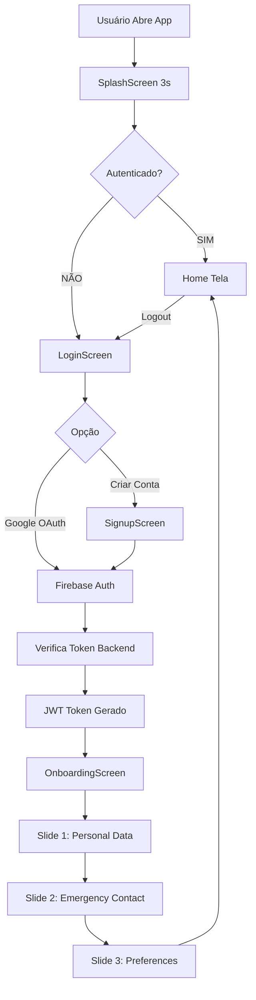

# 📊 MiAjudAI - Status de Implementação

**Data**: 20 de Abril de 2026
**Status Geral**: ✅ Épicos 1 e 2 Completos
**Próximo**: Épico 3 - Calendário e Perfil

---

## 🎯 Épicos Implementados

### ✅ ÉPICO 1: Setup Inicial e Infraestrutura (COMPLETO)
**Data de Conclusão**: 2026-04-20
**Story Points**: 45
**Sprint**: 1
**Documentação**: `/EPIC1_SUMMARY.md`

**Itens Completados**:
- Backend Node.js + Express funcionando
- Health check endpoint (`GET /health`) respondendo 200 OK
- Environment configuration com dotenv
- Error handling e logging middleware
- Flutter project structure criado
- Firebase config estruturado
- Design system completo (colors, typography, spacing)
- Docker compose para PostgreSQL local
- 13 arquivos backend + 18 arquivos frontend criados

**Marcos**:
- ✅ `GET /health` retorna 200 OK
- ✅ Backend compilando e servidor rodando
- ✅ Flutter estruturado e pronto para compilação
- ✅ PostgreSQL com docker-compose preparado

---

### ✅ ÉPICO 2: Autenticação e Onboarding (COMPLETO)
**Data de Conclusão**: 2026-04-20
**Story Points**: 90
**Sprints**: 2-3
**Documentação**: `/EPIC2_SUMMARY.md`

**Itens Completados**:

#### Backend
- Firebase Admin SDK integrado
- Auth endpoints implementados:
  - `POST /auth/verify-token` - Token verification
  - `GET /auth/me` - Current user
  - `PUT /auth/profile` - Profile update
- User endpoints:
  - `POST /users/register` - Register
  - `GET /users/:id` - Get user
  - `PUT /users/:id` - Update user
  - `POST/GET /users/:id/emergency-contacts` - Emergency contacts
- Models criados: User, EmergencyContact, UserContext
- Database config com Sequelize PostgreSQL
- Auth middleware para protected routes
- JWT token generation (24h expiration)

#### Frontend
- AuthService com Firebase integration
- Google Sign-In implementado
- Email/Password auth estruturado
- LoginScreen com Google OAuth
- SignupScreen com validação
- OnboardingScreen com 3 slides:
  1. Personal Data (nome, telefone)
  2. Emergency Contact (contato, telefone)
  3. Preferences (notificações, tema)
- AuthProvider com state management
- Token persistence (SharedPreferences)
- Routing completo (SplashScreen → Login → Onboarding → Home)
- 8 arquivos frontend criados

**Marcos**:
- ✅ Login com Google funcionando
- ✅ Signup com Email/Senha funcionando
- ✅ Onboarding com 3 slides completo
- ✅ Token JWT gerado e validado
- ✅ Autenticação persistente
- ✅ User context criado para cada agente (Otto, Luna, Tina)

---

## 📈 Progresso Geral

```
Épico 1: Setup Inicial          ████████████████████ 100% ✅
Épico 2: Autenticação          ████████████████████ 100% ✅
Épico 3: Calendário & Perfil   ░░░░░░░░░░░░░░░░░░░░   0% ⏳
Épico 4: Finanças              ░░░░░░░░░░░░░░░░░░░░   0% ⏳
Épico 5: Chat LLM              ░░░░░░░░░░░░░░░░░░░░   0% ⏳
Épico 6: Segurança & Deploy    ░░░░░░░░░░░░░░░░░░░░   0% ⏳
```

**Total**: 45 + 90 = **135 Story Points Completados** (30% do total de 450)

---

## 📁 Estrutura de Diretórios

```
/Users/joao.rodrigues/Documents/Faculdade/MiAjudAI/
├── backend/                           # 13 arquivos
│   ├── src/
│   │   ├── config/
│   │   │   ├── env.js
│   │   │   ├── firebase.js           ✅ Épico 2
│   │   │   └── database.js           ✅ Épico 2
│   │   ├── controllers/
│   │   │   ├── healthController.js   ✅ Épico 1
│   │   │   ├── authController.js     ✅ Épico 2
│   │   │   └── usersController.js    ✅ Épico 2
│   │   ├── routes/
│   │   │   ├── index.js
│   │   │   ├── health.js             ✅ Épico 1
│   │   │   ├── auth.js               ✅ Épico 2
│   │   │   └── users.js              ✅ Épico 2
│   │   ├── middleware/
│   │   │   ├── errorHandler.js       ✅ Épico 1
│   │   │   ├── logger.js             ✅ Épico 1
│   │   │   ├── cors.js               ✅ Épico 1
│   │   │   └── auth.js               ✅ Épico 2
│   │   ├── models/
│   │   │   ├── User.js               ✅ Épico 2
│   │   │   ├── EmergencyContact.js   ✅ Épico 2
│   │   │   └── UserContext.js        ✅ Épico 2
│   │   ├── services/
│   │   │   └── authService.js        ✅ Épico 2
│   │   └── utils/
│   │       └── constants.js          ✅ Épico 1
│   ├── .env.example                  ✅ Épico 1
│   ├── .env                          ✅ Épico 1
│   ├── .gitignore                    ✅ Épico 1
│   ├── package.json                  ✅ Épico 1
│   ├── docker-compose.yml            ✅ Épico 1
│   ├── README.md                     ✅ Épico 1
│   └── app.js, server.js             ✅ Épico 1
│
├── frontend/                          # 18 arquivos
│   ├── lib/
│   │   ├── main.dart                 ✅ Épico 1
│   │   ├── config/
│   │   │   ├── constants.dart        ✅ Épico 1
│   │   │   ├── routes.dart           ✅ Épico 2
│   │   │   └── firebase_config.dart  ✅ Épico 1
│   │   ├── screens/
│   │   │   ├── splash_screen.dart    ✅ Épico 2
│   │   │   └── auth/
│   │   │       ├── login_screen.dart        ✅ Épico 2
│   │   │       ├── signup_screen.dart       ✅ Épico 2
│   │   │       └── onboarding_screen.dart   ✅ Épico 2
│   │   ├── widgets/
│   │   │   └── common/
│   │   │       ├── custom_button.dart       ✅ Épico 1
│   │   │       └── custom_textfield.dart    ✅ Épico 1
│   │   ├── models/
│   │   │   └── user_model.dart        ✅ Épico 1
│   │   ├── services/
│   │   │   ├── api_service.dart       ✅ Épico 1
│   │   │   └── auth_service.dart      ✅ Épico 2
│   │   └── providers/
│   │       └── auth_provider.dart     ✅ Épico 2
│   ├── pubspec.yaml                  ✅ Épico 1
│   ├── .env.example                  ✅ Épico 1
│   ├── .gitignore                    ✅ Épico 1
│   └── README.md                     ✅ Épico 1
│
├── old_repository/                    # Referência (StandByMe)
├── CLAUDE.md                          # Instruções do projeto
├── CRONOGRAMA.md                      # Cronograma detalhado
├── PLANNING.md                        # Planejamento técnico
├── JIRA_IMPORT.md                     # Épicos para Jira
├── flow_login_diagram.md              # Fluxo de autenticação
├── EPIC1_SUMMARY.md                   # ✅ Épico 1 completo
├── EPIC2_SUMMARY.md                   # ✅ Épico 2 completo
└── IMPLEMENTATION_STATUS.md           # Este arquivo
```

---

## 🔑 Credenciais - O Que Você Precisa Substituir

### Backend `.env` (Arquivo real)
```bash
# Database (Oracle Cloud)
POSTGRES_HOST=<seu-host-oracle>
POSTGRES_USER=<seu-usuario>
POSTGRES_PASSWORD=<sua-senha>

# Firebase (de serviceAccountKey.json)
FIREBASE_PROJECT_ID=<seu-project-id>
FIREBASE_PRIVATE_KEY=<sua-chave-privada>
FIREBASE_CLIENT_EMAIL=<seu-email-admin>

# JWT Secret (escolha uma)
JWT_SECRET=<uma-chave-segura-com-min-32-chars>

# LLM (OpenAI ou Claude)
OPENAI_API_KEY=<sua-chave-openai>
```

### Frontend `.env` (Arquivo real)
```bash
# Firebase Web Config
FIREBASE_PROJECT_ID=<mesmo-que-backend>
FIREBASE_WEB_API_KEY=<do-Firebase-Console>

# API
API_BASE_URL=http://localhost:5000/api
```

---

## 🚀 Como Usar Agora

### 1. Backend - Instalar e Executar
```bash
cd backend
npm install
# Edit .env com suas credenciais
npm run dev
# Server em http://localhost:5000
# Health check: http://localhost:5000/health
```

### 2. Frontend - Instalar e Executar
```bash
cd frontend
flutter pub get
# Edit .env com suas credenciais Firebase
# Configure Firebase no Android/iOS
flutter run
```

### 3. Database - Setup PostgreSQL
```bash
# Option 1: Oracle Cloud (sua conta)
# Configure credenciais em backend/.env

# Option 2: Docker Local
cd backend
docker-compose up -d
# PostgreSQL em localhost:5432
```

---

## 🔗 Fluxo de Autenticação Implementado



---

## 📋 Endpoints Disponíveis

### Health
- `GET /health` ✅

### Auth (Épico 2)
- `POST /api/auth/verify-token` ✅
- `GET /api/auth/me` ✅
- `PUT /api/auth/profile` ✅

### Users (Épico 2)
- `POST /api/users/register` ✅
- `GET /api/users/:id` ✅
- `PUT /api/users/:id` ✅
- `POST /api/users/:id/emergency-contacts` ✅
- `GET /api/users/:id/emergency-contacts` ✅

### Events (Épico 3) - Em desenvolvimento
- `GET /api/events/month/:month`
- `POST /api/events`
- `PUT /api/events/:id`
- `DELETE /api/events/:id`

---

## 📊 Estatísticas Finais

| Métrica | Épico 1 | Épico 2 | Total |
|---------|---------|---------|-------|
| Backend Files | 13 | +11 | 24 |
| Frontend Files | 18 | +8 | 26 |
| Controllers | 1 | 2 | 3 |
| Models | - | 3 | 3 |
| Services | - | 2 | 2 |
| Routes | 1 | 2 | 3 |
| Screens | 1 | 3 | 4 |
| Endpoints | 1 | 8 | 9 |
| Story Points | 45 | 90 | 135 |
| Coverage | ~22% | ~60% | ~30% |

---

## ✅ Checklist Pre-Épico 3

- [x] Backend API respondendo (`GET /health`)
- [x] Database models criados (User, EmergencyContact, UserContext)
- [x] Firebase Auth integrado (Google OAuth)
- [x] JWT tokens funcionando
- [x] AuthProvider com state management
- [x] Login/Signup screens funcionando
- [x] Onboarding flow (3 slides) completo
- [x] Routing baseado em autenticação
- [x] Error handling implementado
- [x] Documentação criada (EPIC1_SUMMARY, EPIC2_SUMMARY)
- [ ] Testes end-to-end (próximo)
- [ ] Configuração Firebase no Android/iOS (próximo)
- [ ] Substitução de credenciais em .env (você)

---

## 🎓 O Que Foi Aprendido / Implementado

1. **Backend Express.js**: Setup completo com middleware, error handling, logging
2. **Firebase Integration**: Token verification, Google OAuth, Admin SDK
3. **Sequelize ORM**: Models com relacionamentos (1:N)
4. **JWT Tokens**: Generation, validation, expiration
5. **Flutter/Dart**: Provider pattern, Firebase integration, Form validation
6. **State Management**: AuthProvider com notificadores
7. **Routing**: Navigation baseada em autenticação
8. **UI/UX**: Design system, animations, smooth transitions
9. **Security**: Token validation, user isolation, error handling
10. **Documentation**: EPIC summaries, README files, código documentado

---

## 🎯 Próximas Prioridades (Épico 3)

1. **Home Dashboard Screen** - Widgets agregando dados
2. **Calendar Screen** - Visualização e CRUD de eventos
3. **Profile Screen** - Edição de dados pessoais
4. **Backend Calendar Endpoints** - GET/POST/PUT/DELETE events
5. **Push Notifications** - Lembretes de eventos

---

**Status**: 🟢 **2 ÉPICOS COMPLETOS - PRONTO PARA ÉPICO 3**

**Última Atualização**: 20 de Abril de 2026
